[TOC]

# 2018

## 班级档案管理系统

2018.05~2018.06

实现：C

一个基于C语言的可视化班级档案管理系统，可以管理学生的基本信息，包括学号，姓名，性别，年龄以及备注。使用结构体+二进制文件保存数据，通过接收键盘操作来进行界面控制。代码以及编译后的可执行文件在此：[18_C_management](18_C_management/)

主要功能有录入、显示、保存、删除、修改以及按多种类型的关键字进行查询操作。

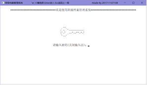
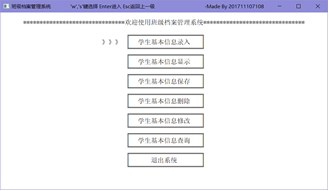

使用密码abc进入系统即可，通过选择对应的功能项，可以进行增删改查的操作。

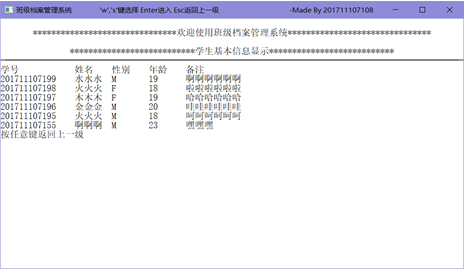
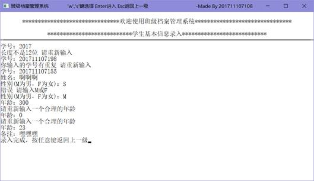
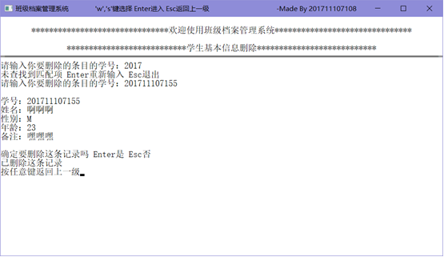
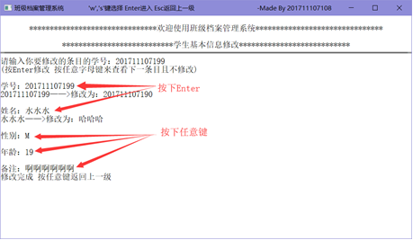

​    在使用查询时，会进入二级界面，可以按需选择查询类型。

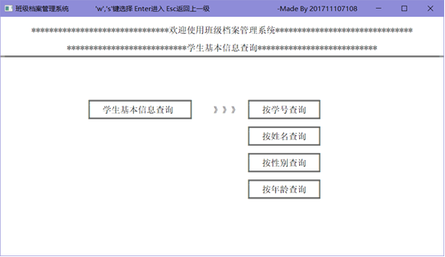
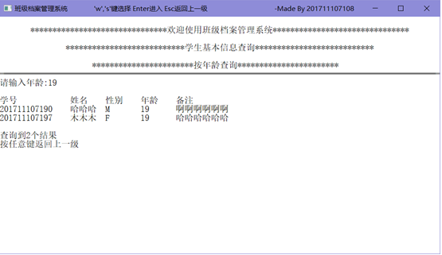

# 2019

## 分布式系统Hadoop搭建

2019.05~2019.06

实现：Java

主要介绍了Hadoop的搭建方法，以及使用单机模式进行简单的环境测试，详情请看PPT：[ppt](19_Java_Hadoop/MapReduce&SecondarySort.pptx)

## 智能图像分类系统

2019.08~2019.09

实现：Python

部分源码：[19_Python_img_classification](19_Python_img_classification/)

通过使用Darknet框架的YOLO算法，以及TesseractOCR引擎，对图像数据库进行对象识别以及文字提取，再加上图像本身的Exif信息，可以将庞大的图像数据库建立索引，以便进行图像查询。

对于视频文件，使用关键帧算法提取视频中的关键图像，通过对关键图像进行对象识别以及文字提取，同样可以对视频进行索引。19_Python_img_classification/)

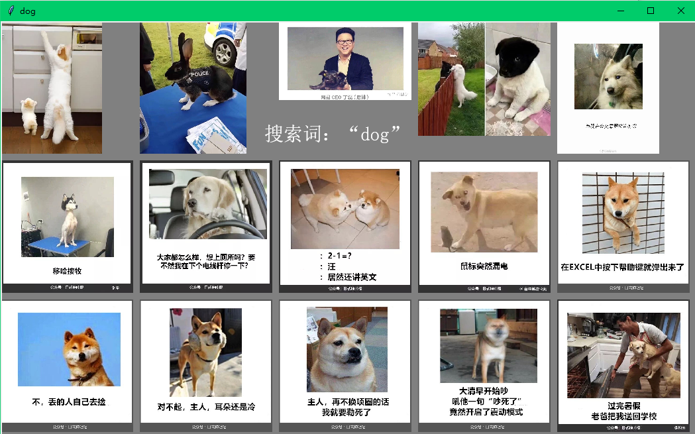

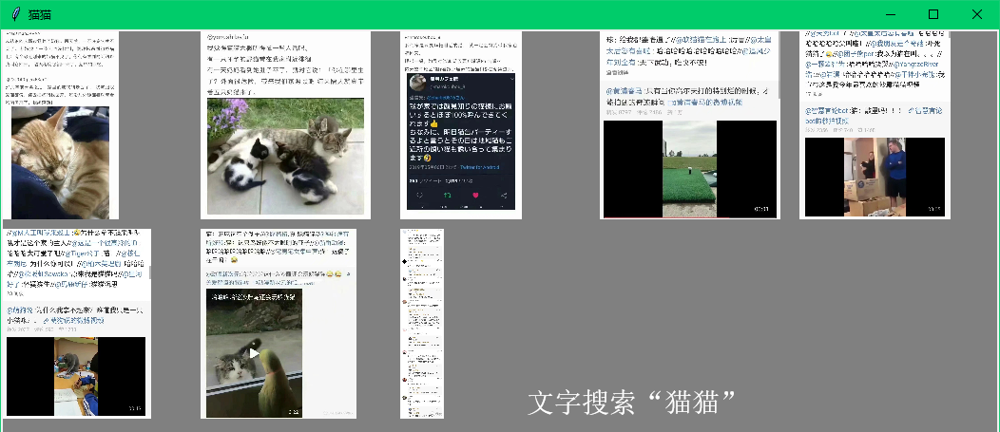

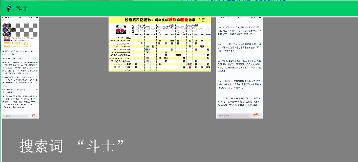

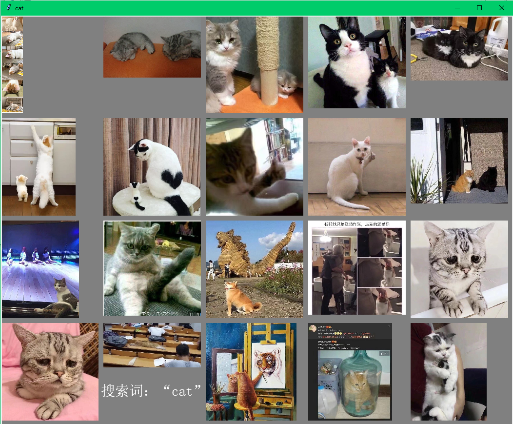

## 图像数据库检索系统

2019.11~2019.12

实现：Python/PyQt5/SQLite

源码：[19_Python_img_search](19_Python_img_search/)

对于上一个系统产生的结果，使用的是JSON格式进行储存，在查询效率和灵活性方面有欠缺和不足，因此该项目使用SQLite对数据进行了重新整理，并使用PyQt5重新绘制了一个高效的界面，可以更容易地执行查询操作，并且可以更好地显示查询结果。程序界面如下图所示：

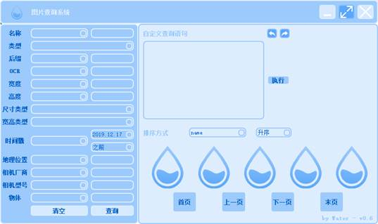

在左侧输入查询条件，右上部分可根据条件生成查询语句，右下角则会显示查询结果。鼠标移动到图像上，可以查看图像的更多属性。

比如可以使用地理位置查询某个地方附近的所有图像（图略）；查询图像中出现的文字（图略）；

查询所有包含猫的图像；

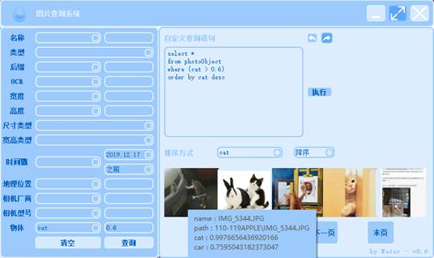

查询某个时间以前的方形小尺寸图像；

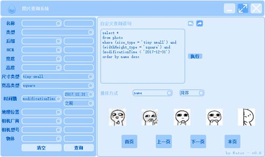

以及可以右键显示的图像来执行更多操作：

# 2020

## 基于Gossip的节点消息同步系统

2020.05~2020.06

实现：Python

使用Python模拟实现了一个基于Gossip算法的节点消息同步系统，这是一个类似于谣言传播的算法，在网络中，每个节点都随机于其他节点通信，最终所有节点的状态都能达成一致。

[一个文件](20_Python_Gossip/gossip v0.2.1.py)实现算法的原理模拟，[另一个文件](20_Python_Gossip/animation v0.2.0.py)实现模拟动画的绘制。

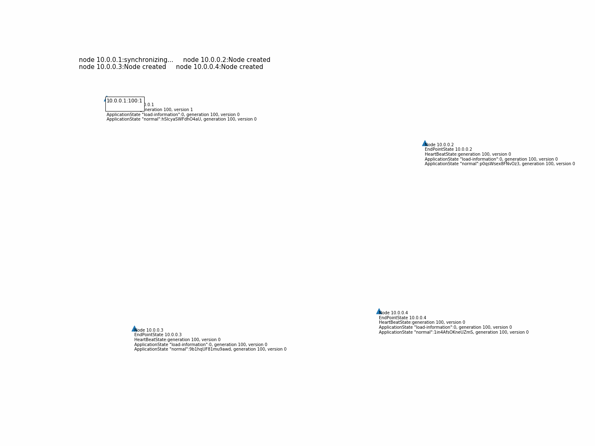

动画演示的更长版本：[generation 174.gif.7z](20_Python_Gossip/generation 174.gif.7z)

## 基于Apriori算法的推荐系统

2020.05~2020.06

实现：Python

使用Python实现了一个基于Apriori算法的推荐系统，通过收集系统中文件、文件夹和某些应用程序的启动记录以及启动时间，挖掘出多个程序之间的关联，从而进行推荐。

例如当你频繁地会在打开A程序以后又打开B，那么系统之后就会认为打开A（或B）的同时，有可能打开B（或A），从而推荐用户打开另一个程序。

详细介绍可参考：[ppt](20_Python_Apriori/基于Apriori算法的应用推荐.pptx)

## 实习

2020.08~2020.09

实现：Java

负责开发了xx软件，并且编写了软件的用户手册，以及申请软件著作权所需的相关文档。

# 2021

## 音乐生成

2021.01~2021.06

实现：Python

使用基于RNN的网络以及[Magenta](https://github.com/magenta/magenta)的项目，完成了这个音乐生成项目，可以用于快速转换训练数据集格式、开启训练和测试、以及生成音乐。

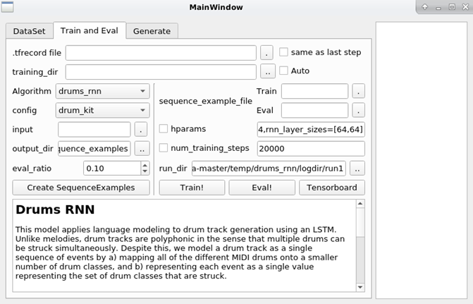

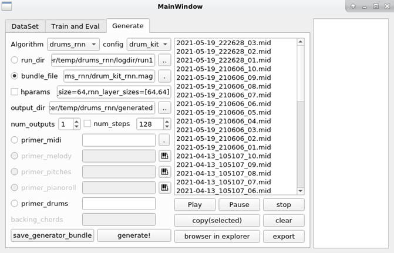

# 2022

## Wiki数据库系统

2021.12~2022.01

实现：Vue/HTML

使用一个关系型数据库来实现Wikidata的存取，通过将JSON格式的Wikidata文件读取并写入到数据库中，并且能够按照要求实现特定的查询功能。

本人负责该系统的前端实现，使用Vue框架完成，源码：[22_Vue_Wiki](22_Vue_Wiki/)

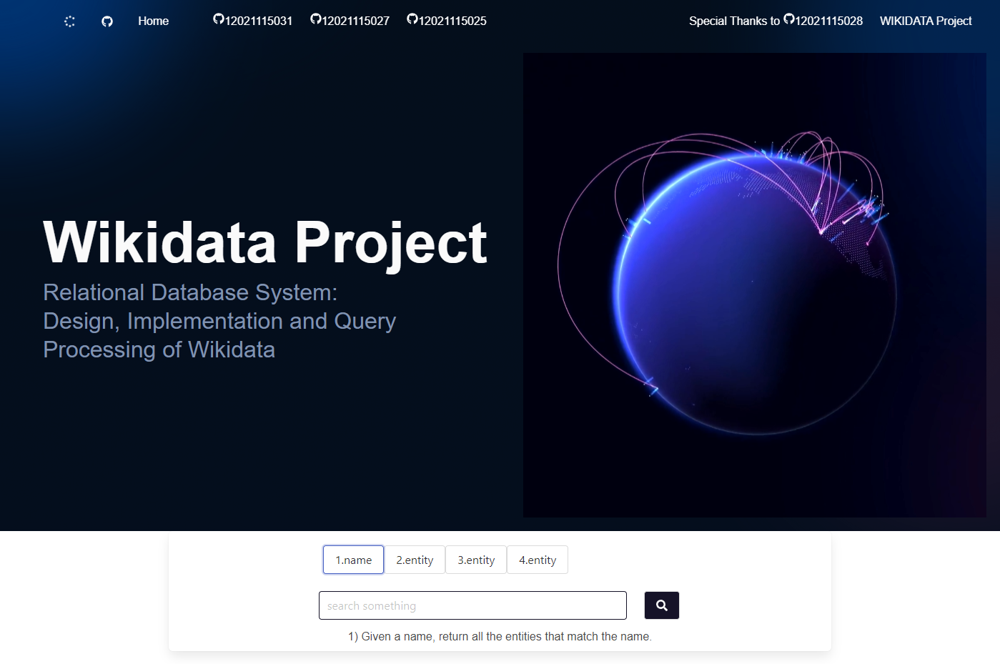

## iOS\iPad应用: MyDay

2022.02~2022.05

实现：Swift/Python

一个以子项目为主导的 ToDo-List 应用程序，前端使用 SwiftUI 框架编写，可以在 iPhone、iPad 和 Mac 上运行。基本功能有创建 Todo 项目以及其所属子 Todo 项目，完成打卡以及展示打卡结果。

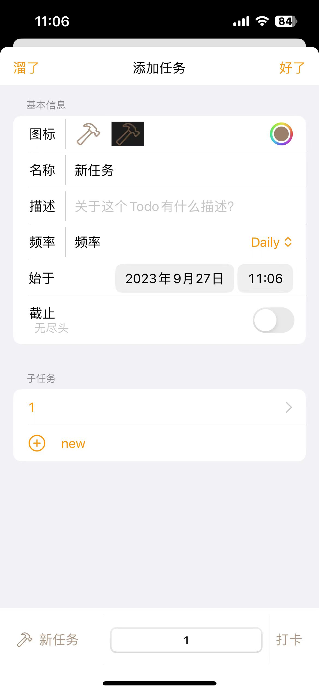
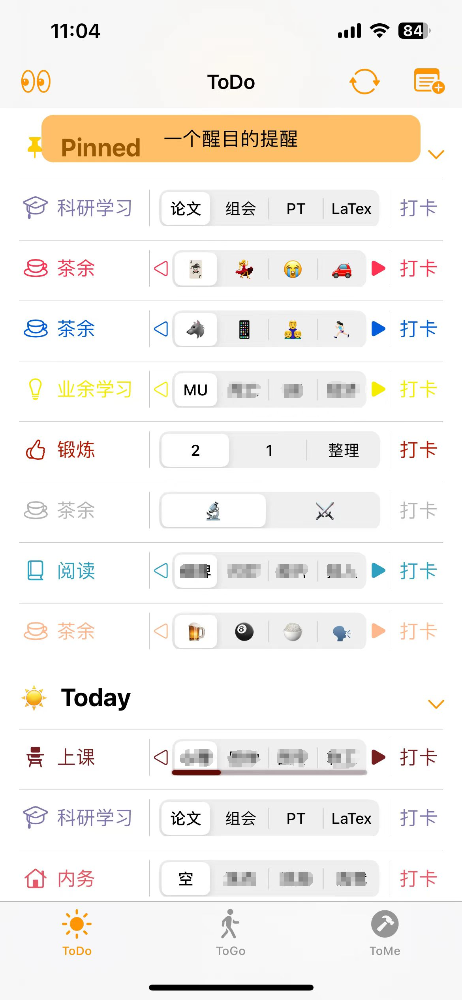
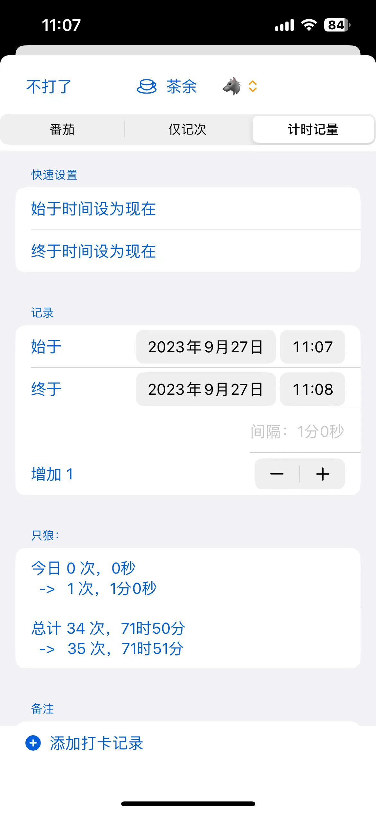
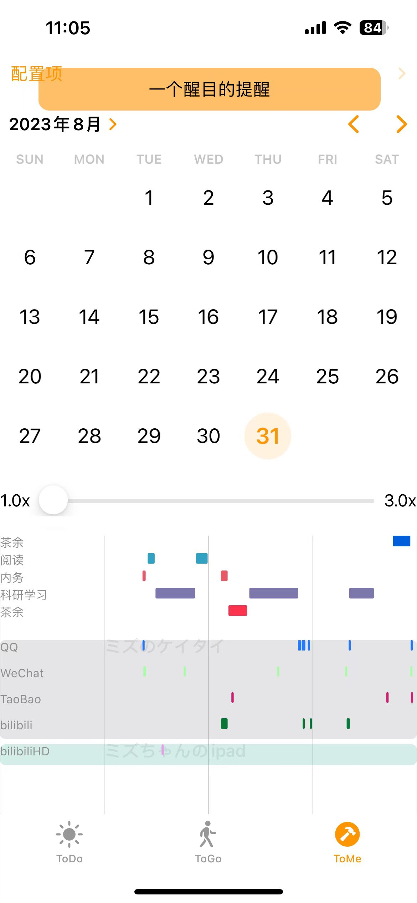

此外，软件在隐私性上有特殊设计，所有条目都拥有别名，只有本人可以通过验证后才能查看条目的原名。（上图中的马赛克为后期效果，软件中显示的是正常内容）

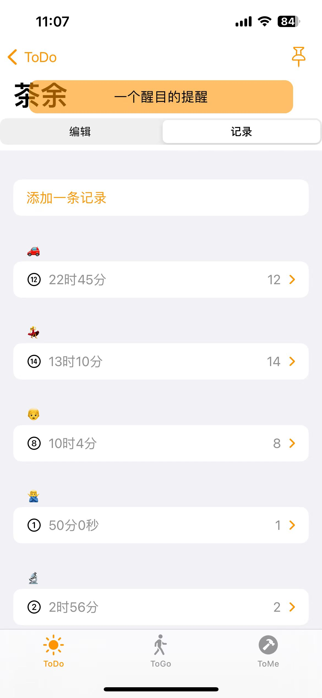

为了实现多端同步以及打卡的灵活性，使用 Flask 编写了后端，扩展了打卡类型，可以在不打开软件的情况下，仅使用 HTTP 协议就能完成打卡，而且所有数据都可以在多个设备之间同步。

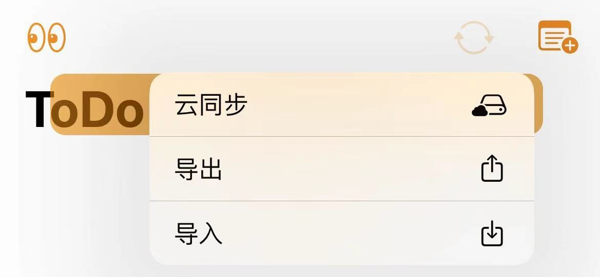

前端源码：[front end](22_SwiftPython_MyDay/front end)

后端源码：[backend](22_SwiftPython_MyDay/backend)

# 2023

## 基于MITM的中间缓存器

实现：Python

一个基于MITM（Man-in-the-middle）的中间缓存器，通过拦截特定网站的 Request 和 Response，可以将 Response 缓存在本地电脑中，之后再次遇到相同的 Request 时，直接使用本地的缓存来作为 Response，在一些流量受限的网站、经常性访问相同文件的网站（如图像，视频），使用中间缓存可以大幅提升响应速度，提升网站使用体验。

此外，对于某些网站，基于拦截到的 JSON 文件，可以将其解析之后储存到数据库中，便于以后更容易地按需查询曾经浏览过的内容。

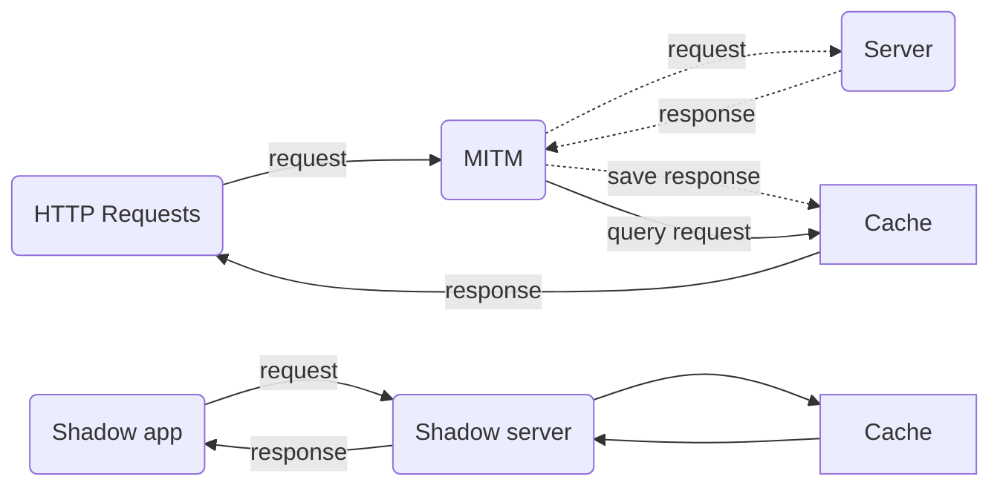

